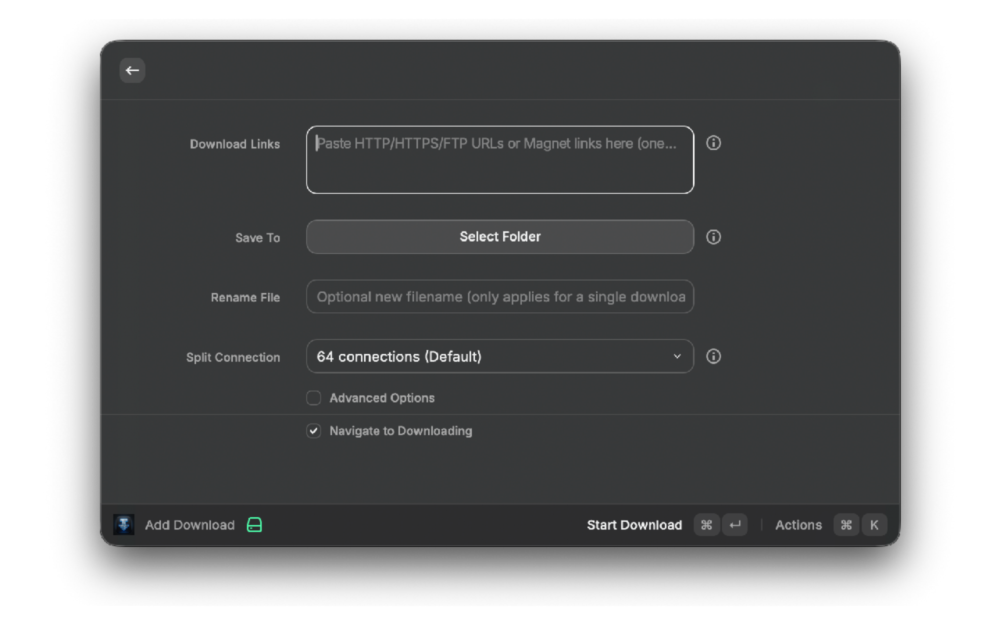
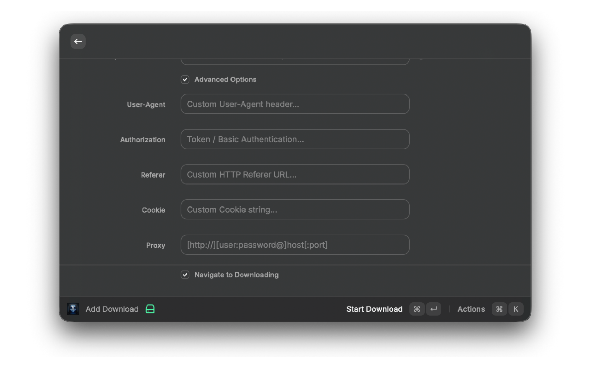
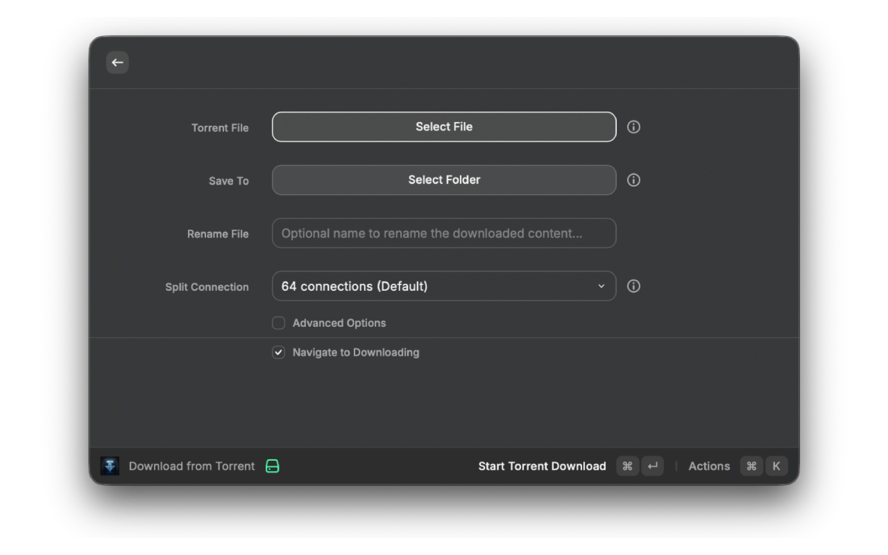
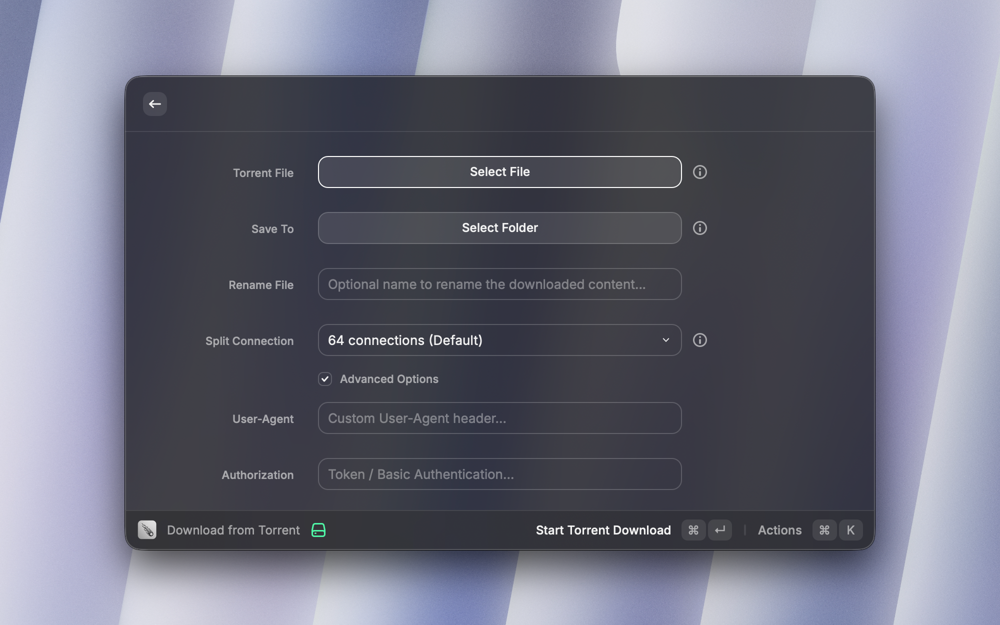

# Meteor

A premium, high-speed download manager for Raycast powered by [aria2](https://aria2.github.io/). Download files, torrents, and magnet links with multi-connection acceleration.

---

## Screenshots

### 1. Download Interface
Easily queue new downloads by pasting URLs. Customize the save directory, number of connection splits, and configure advanced Curl-style options like custom User-Agents, Cookies, Referers, or proxy servers.



### 2. Tasks View
Monitor and manage your download queue in a unified list. View download speeds, progress percentages, file sizes, and estimated times of arrival (ETA) at a glance.



### 3. The Download Task Progress View
Drill down into any active download to see a live piece-map grid, visualizing exactly which chunks have been downloaded in real-time as reported by the underlying engine.



### 4. Torrent Client View
Load local `.torrent` files directly from Finder. The extension automatically detects your selected file in Finder and pre-fills the path for quick queueing.



---

## Features

- **High-Speed Accelerations** — Splits files into multiple connections for accelerated chunk downloading.
- **Unified Task Dashboard** — Manage active, waiting, paused, completed, and failed downloads in one place.
- **Advanced Request Headers** — Specify cookies, mock User-Agents, custom referers, and authorization credentials for protected download links.
- **Finder Integration** — Select a `.torrent` file in Finder and trigger the download instantly from Raycast.
- **Visual Chunk Mapping** — A live grid visualization of download pieces showing active chunk progression.
- **Local Daemon Auto-Start** — Zero-setup configuration that automatically launches a local background daemon using precompiled macOS binaries.
- **Session Persistence** — Automatically saves active tasks every 10 seconds, ensuring your queue survives system reboots or daemon restarts.

---

## Requirements

### Option A — Bundled Binary (Recommended)
No installation needed. The extension bundles precompiled `aria2c` binaries for both Apple Silicon (`arm64`) and Intel (`x64`) Macs, automatically executing the correct one for your system.

### Option B — System Homebrew
If you prefer to use your own system-installed version of `aria2`, install it via Homebrew:

```bash
brew install aria2
```

The extension will automatically detect it in your standard PATH or Homebrew directories.

---

## Configuration

### Extension Preferences (Raycast Settings)

| Setting | Default | Description |
|---|---|---|
| **Aria2 RPC Port** | `6800` | Port for the local or remote JSON-RPC server |
| **RPC Secret Token** | _(empty)_ | Optional authentication secret token |
| **Auto-Start Daemon** | On | Automatically launch the local background daemon on startup |
| **Verify SSL Certificates** | Off | Enforce HTTPS certificate validation |
| **Automatic Updates** | On | Enable background extension updates from the Raycast Store |

### In-App Settings

Open the **Configuration** command in Raycast to set:
- Default save directories.
- Download and upload speed limits.
- BitTorrent encryption, metadata saving, and seeding ratio rules.
- Maximum concurrent downloads and server connection limits.
- User-Agent presets (Chrome, Transmission, Wget, Aria2).

---

## Contributing

Issues and Pull Requests are welcome at [github.com/mvrck-dev/meteor](https://github.com/mvrck-dev/meteor).
